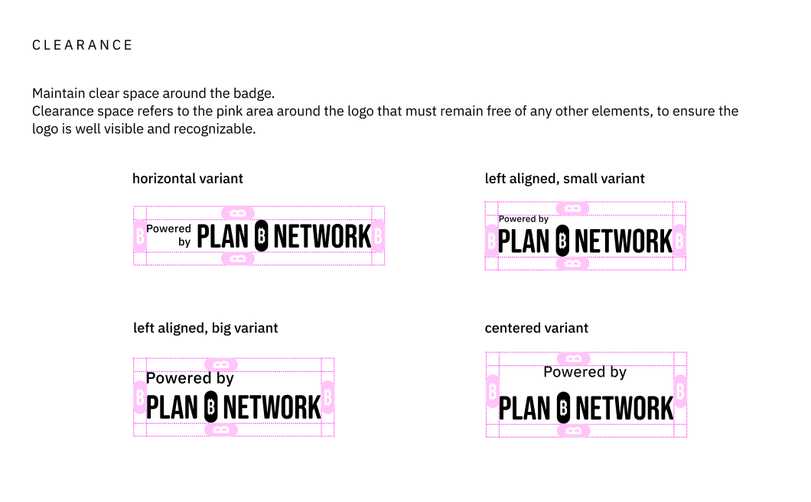

# Brand Guidelines for "Powered by Plan ₿ Network" Projects

These guidelines help maintain clarity, consistency, and credibility across all projects that carry the "Powered by Plan ₿ Network" label.

## 1. Logo Usage

Use the official “Powered by Plan ₿ Network” badge to signal your project's affiliation with the ecosystem.

Do:

- Use the badge on your website/app footer, About section, or README
- Respect minimum clear space (equal to the width of the ₿ symbol)
- Use light or dark version based on background contrast

Don't:

- Change logo colors or proportions
- Add visual effects or shadows
- Place the logo over busy or low-contrast backgrounds

## 2. Typography and Colors

To ensure visual consistency across all affiliated projects, use the following approved type and color system.

### Typography

Primary Typeface: IBM Plex Sans (Open-source and available via Google Fonts)

Use this for all headings, UI text, and body content.

### Core Brand Colors

| Name          | HEX Code | Usage                        |
| ------------- | -------- | ---------------------------- |
| Plan ₿ Orange | #FF5C00  | Primary action & brand color |
| Black         | #000000  | Backgrounds, text            |
| White         | #FFFFFF  | Backgrounds, contrast        |

### UX/UI Orange Range

For interface design, please use the following shades derived from the primary Plan ₿ Orange:

| Shade | HEX     |
| ----- | ------- |
| 50    | #FFEEE5 |
| 100   | #FFD1B7 |
| 200   | #FFB48A |
| 300   | #FF975C |
| 400   | #FF792E |
| 500   | #FF5C00 |
| 600   | #D64D00 |
| 700   | #AD3F00 |
| 800   | #853000 |
| 900   | #5C2100 |
| 950   | #411800 |

These should be used for hover states, highlights, borders, and interface elements. Maintain appropriate contrast for accessibility.

### Optional Brown-Neutral Range

For use in dark-themed interfaces or when blending orange with background elements:

| Shade | HEX     |
| ----- | ------- |
| 50    | #F1EEEC |
| 100   | #E3DDD9 |
| 200   | #D6CCC6 |
| 300   | #C8BCB4 |
| 400   | #BBABA2 |
| 500   | #A18C7F |
| 600   | #876D5D |
| 700   | #695142 |
| 800   | #49372C |
| 900   | #2B1F18 |
| 950   | #100A07 |

## 3. Voice and Tone

Plan ₿ Network promotes clarity, inclusiveness, and educational integrity in Bitcoin. Projects should reflect those values through consistent voice and tone.

Use a tone that is:

- Clear and human
- Educational rather than promotional
- Respectful and Bitcoin-native

Avoid:

- Hype or over-promising
- Confusing financial claims
- Excessive jargon without context

## 4. Attribution Requirements

All "Powered by Plan ₿ Network" projects must include visible attribution in at least one of the following locations:

- Website footer, About page, or Credits section
- App login screen, dashboard, or Help section
- Documentation (e.g., GitHub README or homepage)

### Example text:

"This project is proudly powered by Plan ₿ Network, a global network dedicated to Bitcoin adoption and freedom tech through education, open-source software, and community-building"

For media (videos, slides, infographics), include the attribution in footers or closing credits where possible.

## 5. Badge Variants & Clear Space

Projects powered by Plan ₿ Network must use one of the approved badge variants provided below.

To support diverse layout needs and backgrounds, there are 24 total variants across 4 layouts, 2 background types, and 3 pill styles.

### Layout Options

1. **Horizontal Layout**
2. **Left-Aligned (Small)**
3. **Left-Aligned (Large)**
4. **Centered Layout**

Each layout is available in both **light** and **dark** background versions.

### Pill Styles

Each badge layout includes 3 pill styles within the Plan ₿ Network logo to match your brand tone or interface design:

- **Orange Fill Pill** — strong, bold color
- **Orange Gradient Pill** — smooth and modern
- **Neutral Pill** — subtle, minimal styling

### Download Badge Variant

| Layout               | Background | Orange Pill                                                   | Neutral Pill                                                   | Gradient Pill                                                   |
| -------------------- | ---------- | ------------------------------------------------------------- | -------------------------------------------------------------- | --------------------------------------------------------------- |
| Horizontal           | Light      | [🖼️](./assets/horizontal/light_background/orange.svg)         | [🖼️](./assets/horizontal/light_background/neutral.svg)         | [🖼️](./assets/horizontal/light_background/gradient.svg)         |
| Horizontal           | Dark       | [🖼️](./assets/horizontal/dark_background/orange.svg)          | [🖼️](./assets/horizontal/dark_background/neutral.svg)          | [🖼️](./assets/horizontal/dark_background/gradient.svg)          |
| Left-Aligned (Small) | Light      | [🖼️](./assets/left_aligned_small/light_background/orange.svg) | [🖼️](./assets/left_aligned_small/light_background/neutral.svg) | [🖼️](./assets/left_aligned_small/light_background/gradient.svg) |
| Left-Aligned (Small) | Dark       | [🖼️](./assets/left_aligned_small/dark_background/orange.svg)  | [🖼️](./assets/left_aligned_small/dark_background/neutral.svg)  | [🖼️](./assets/left_aligned_small/dark_background/gradient.svg)  |
| Left-Aligned (Large) | Light      | [🖼️](./assets/left_aligned_big/light_background/orange.svg)   | [🖼️](./assets/left_aligned_big/light_background/neutral.svg)   | [🖼️](./assets/left_aligned_big/light_background/gradient.svg)   |
| Left-Aligned (Large) | Dark       | [🖼️](./assets/left_aligned_big/dark_background/orange.svg)    | [🖼️](./assets/left_aligned_big/dark_background/neutral.svg)    | [🖼️](./assets/left_aligned_big/dark_background/gradient.svg)    |
| Centered             | Light      | [🖼️](./assets/centered/light_background/orange.svg)           | [🖼️](./assets/centered/light_background/neutral.svg)           | [🖼️](./assets/centered/light_background/gradient.svg)           |
| Centered             | Dark       | [🖼️](./assets/centered/dark_background/orange.svg)            | [🖼️](./assets/centered/dark_background/neutral.svg)            | [🖼️](./assets/centered/dark_background/gradient.svg)            |

### Clear Space Guidelines

To preserve the integrity of the badge, maintain a minimum clear space around it equal to the width of the ₿ symbol.

This zone must remain free of text, UI elements, or graphic distractions. Do not crop or stretch the badge.

### Badge Usage Notes

- Choose the layout and style that best fits your project’s UI — but do not modify colors, proportions, or typography.
- Use SVG or high-resolution PNG files for clean rendering.
- For accessibility, ensure strong contrast with your background.

## Questions?

For suggestions or questions about these guidelines, feel free to open an issue or reach out to the Plan ₿ Network team directly.
